1982 Modem
==========

Guide to building what must be the simplest WiFi modem possible for retro computer use.

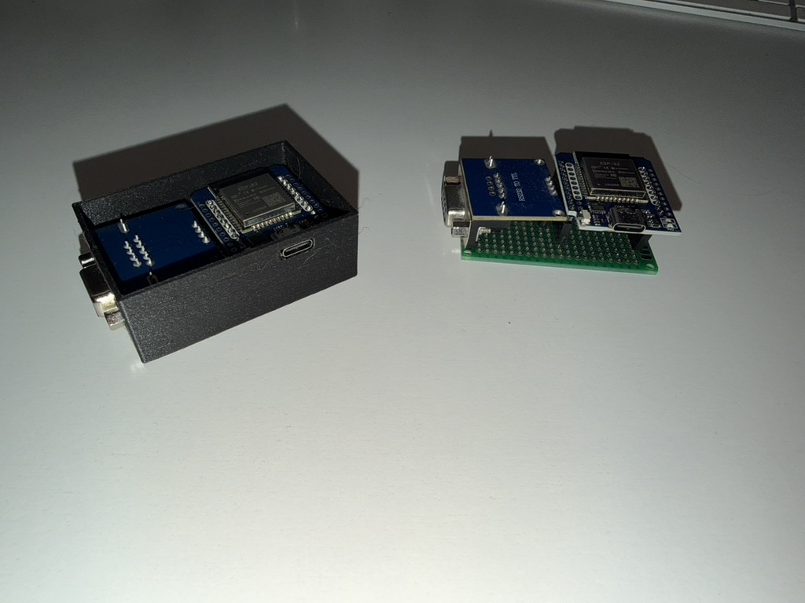

Bill of materials
-----------------

- 1x Mini ESP32 D1
- 1x MAX3232 Dev Board
- 1x 14x20 Prototype PCB
- 2x 10 pin headers
- 2x 10 pin header sockets
- 1x 4 pin header socket
- USB C Cable
- Serial cable

> Make sure you get the MAX3232 and not the MAX232, as only the 3232 uses 3.3v like the ESP32.

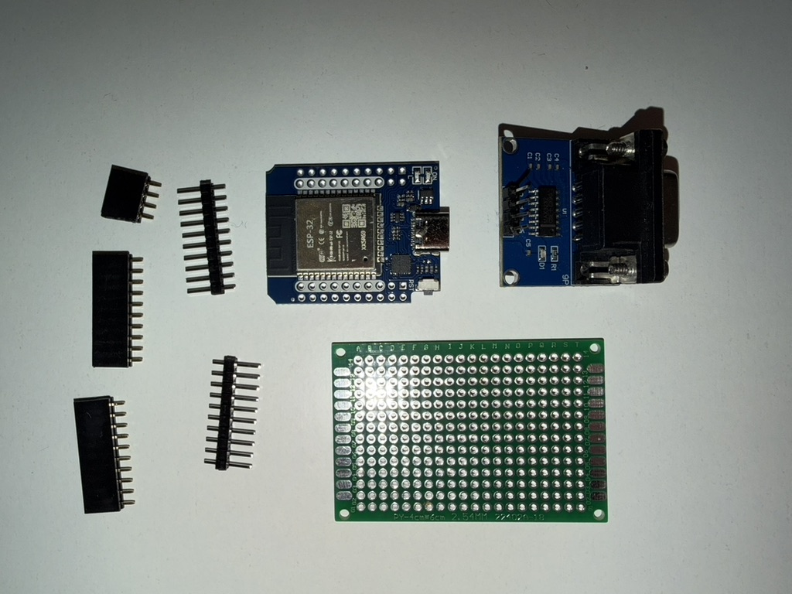
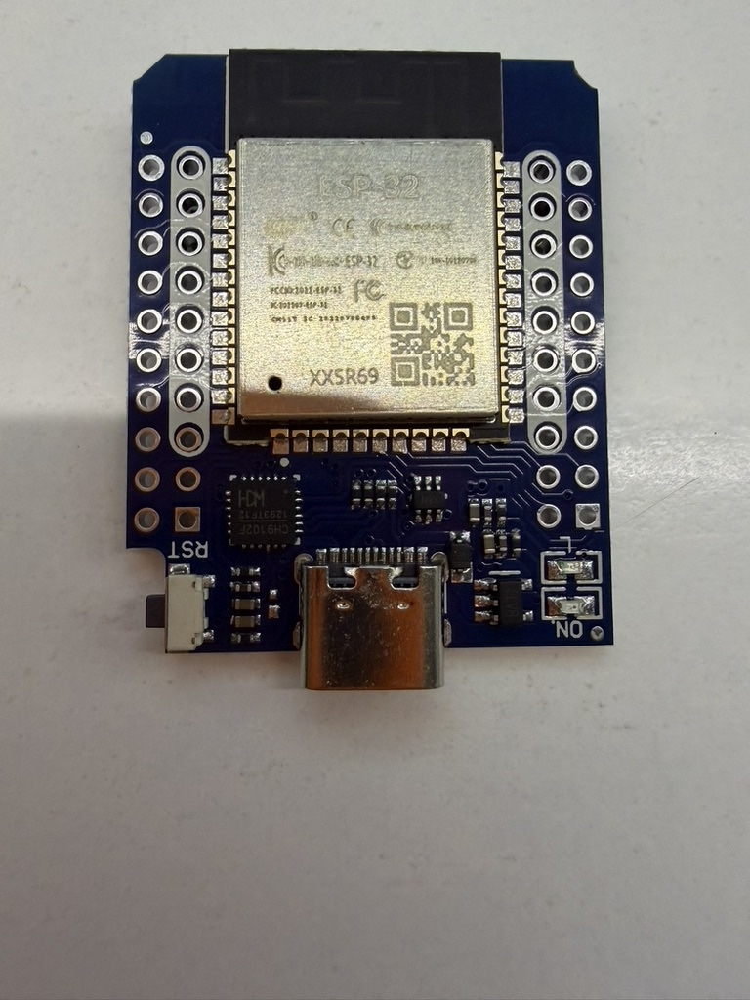
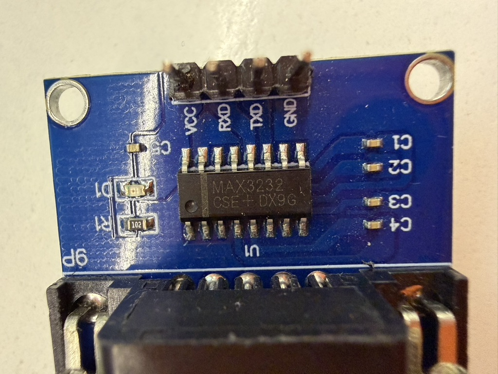

Case
----

Optionally you can 3D print a case for it available here

[1982 Wifi Modem Case on Thingiverse](https://www.thingiverse.com/thing:7308642)

Assembly
--------

Solder the large sockets on to the board in the centre of row A, J and the small socket in M

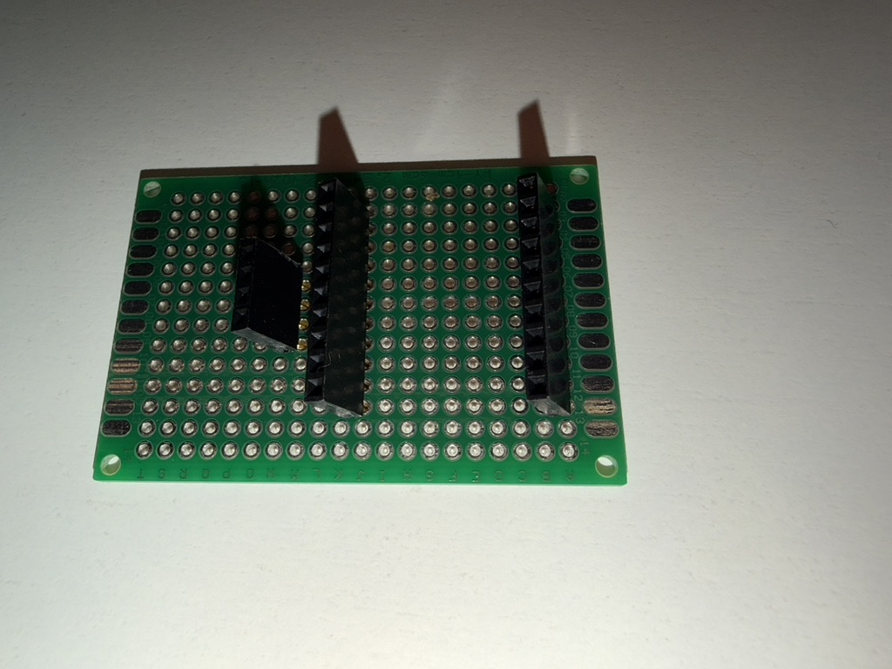

Solder the header pins to the underside of the ESP32 Mini, the inner pads only

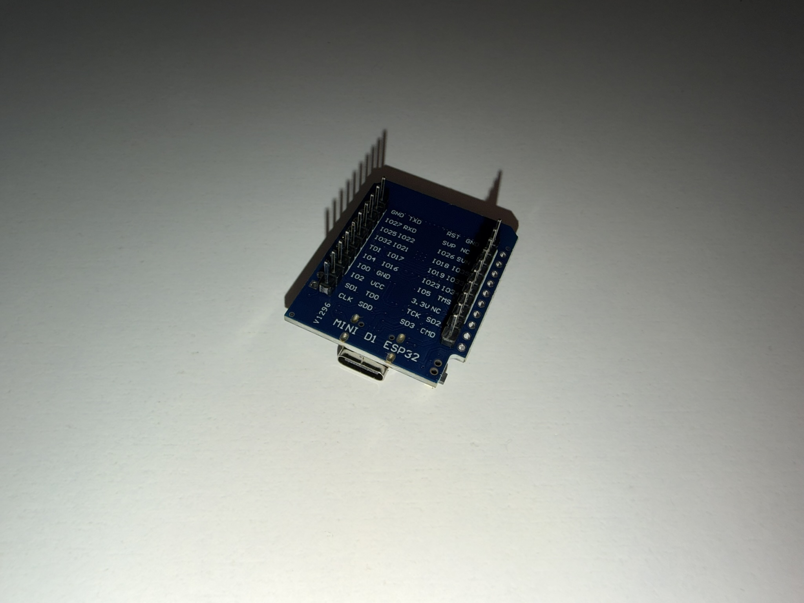

Using a thin gauge wire, connect the pins as per the image

- M6 to A5
- M7 to J10
- M8 to A8
- M9 to A6

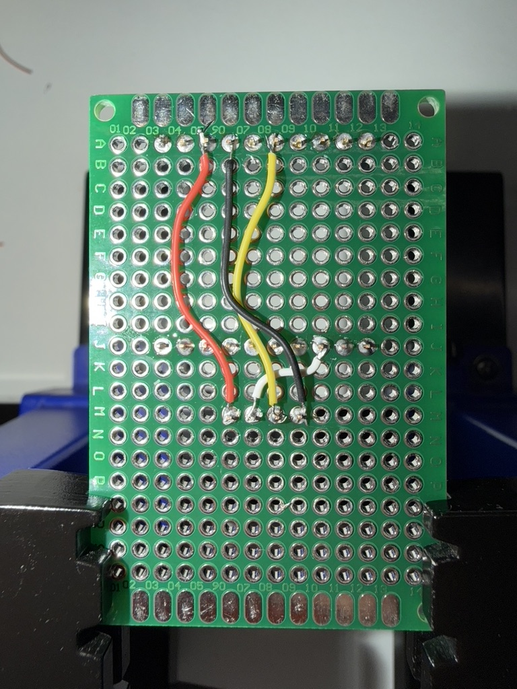

Flash the software
------------------

You will need to install `git` and `Arduino IDE`

In the terminal run:

    git clone https://github.com/bozimmerman/Zimodem.git

Open this project up in Arduino IDE, and then open the file `zimodem.ino` (it should be already open). Add somewhere in the file:

    //Added for 1982 Modem
    #  define DEFAULT_PIN_TXD GPIO_NUM_17
    #  define DEFAULT_PIN_RXD GPIO_NUM_26

This just configures the serial port of the board to use the pins we selected.

Toward  the top of the file there are a lot of definitions starting `INCLUDE_*`. You can use these to enable certain optional features. SSH would be a useful one to set to `true`.

You will need to make sure ESP32 support is installed in Arduino IDE

> Example ESP32+Arduino IDE tutorial for windows, pretty much the same for mac and linux: https://randomnerdtutorials.com/installing-the-esp32-board-in-arduino-ide-windows-instructions/

Now connect the ESP32 using the USB C cable, select the port, select the board (I used NodeMCU-32S) and flash the board with your modified ZiModem firmware.

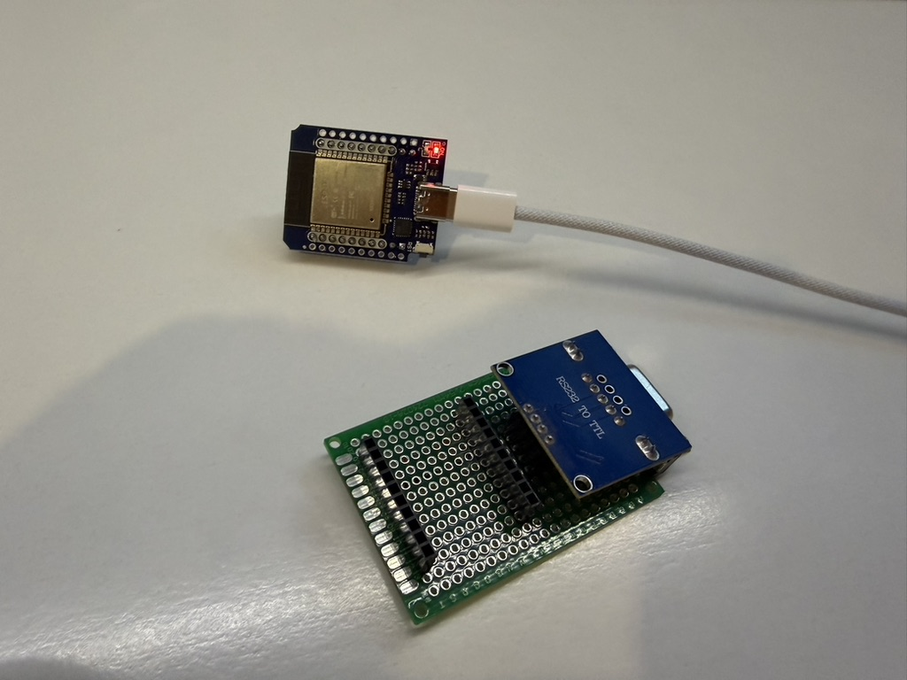

Final assembly
--------------

If you printed a case, now you can put the components in.

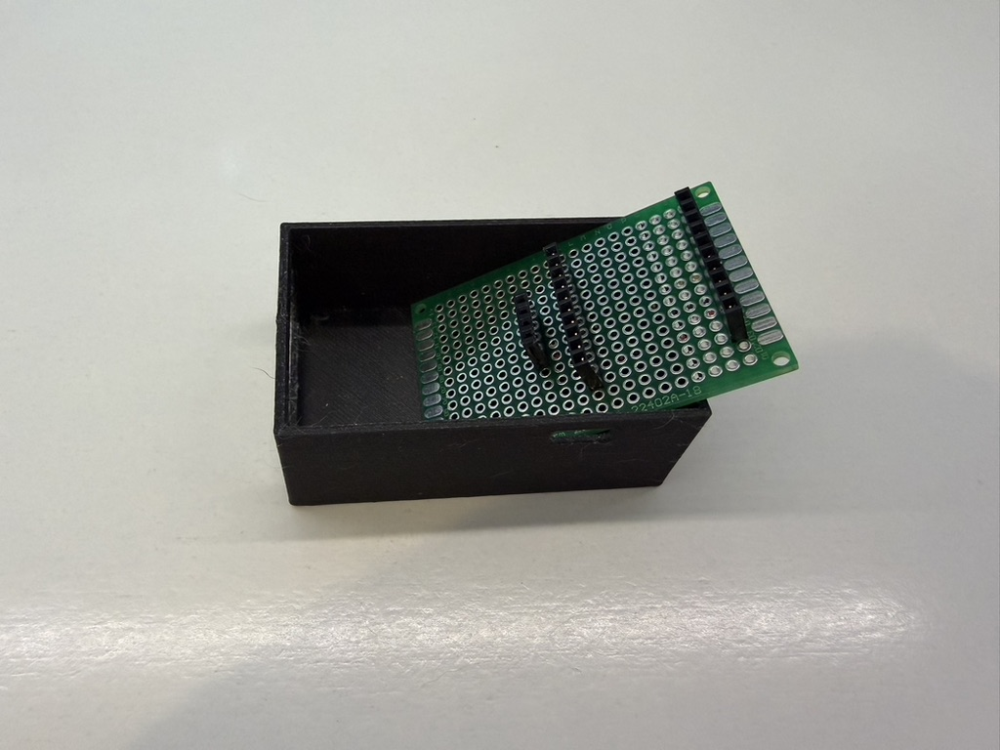
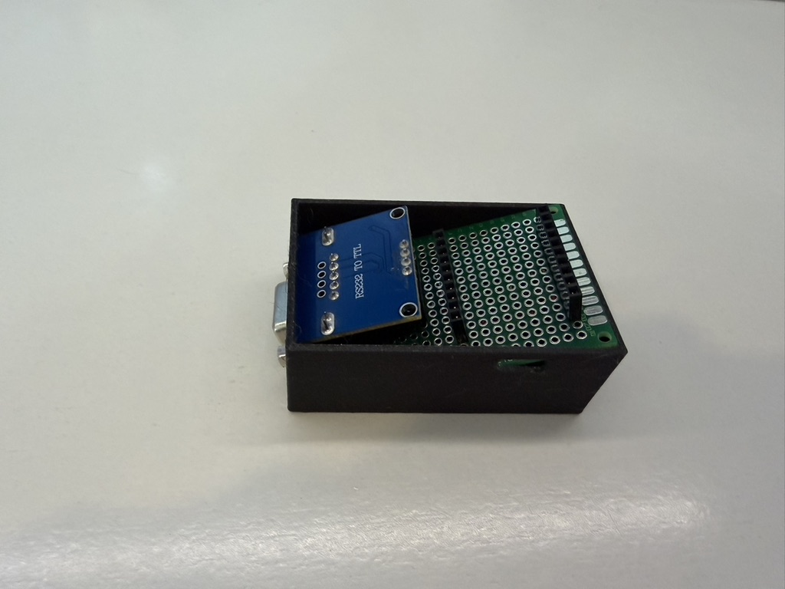
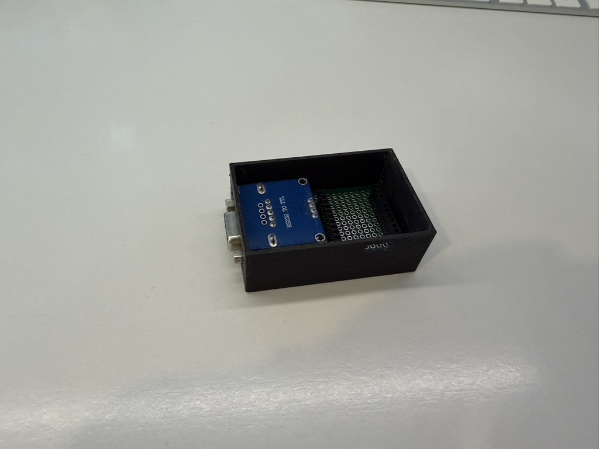
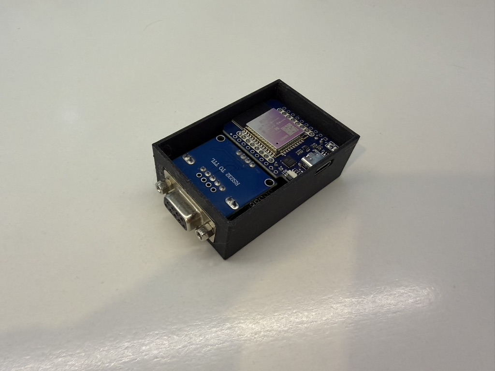

If you have some very small screws, you can screw the board to the bottom of the case. I had some from a laptop hard drive lying around. If you dont, it should not matter as the lid will hold it together.

Finally put the lid on and line the two inserts up with the holes in the MAX 2323 to keep it in place.

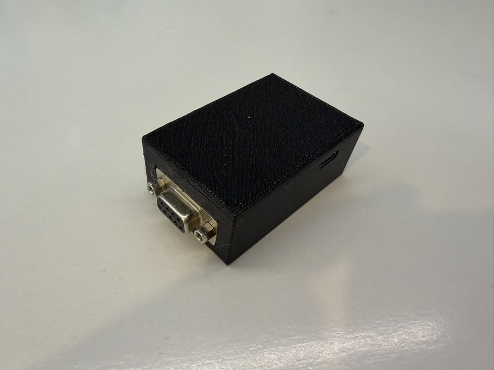

Testing
-------

Plug your modem in to your your computer's serial port and connect using 1200 baud, 8N1, No flow control.

Now to test its working, AT should produce OK:

    AT
    OK

To set up Wifi

    AT+CONFIG

and follow instructions. Also in here you can assign fake numbers to point to BBS or SSH hosts. When you have a fake number such as 5555555 set up, use

    ATD5555555

to connect to the server.

For full docs, refer to the Zimodem README on github.

A310 Modification
-----------------

To get this to work on an Acorn Archimedes (A310, and possibly other machines), the following modification is necessary. 

* Connect Data Set Ready (DSR), Carrier Detect (CD), and Data Terminal Ready (DTR)
* Connect Clear to Send (CTS) and Request to Send (RTS)

Some (older) serial chips are less forgiving than others and wait for proper handshaking before allowing data to be sent. This is to trick the computer into thinking that it is talking to a compliant serial device.

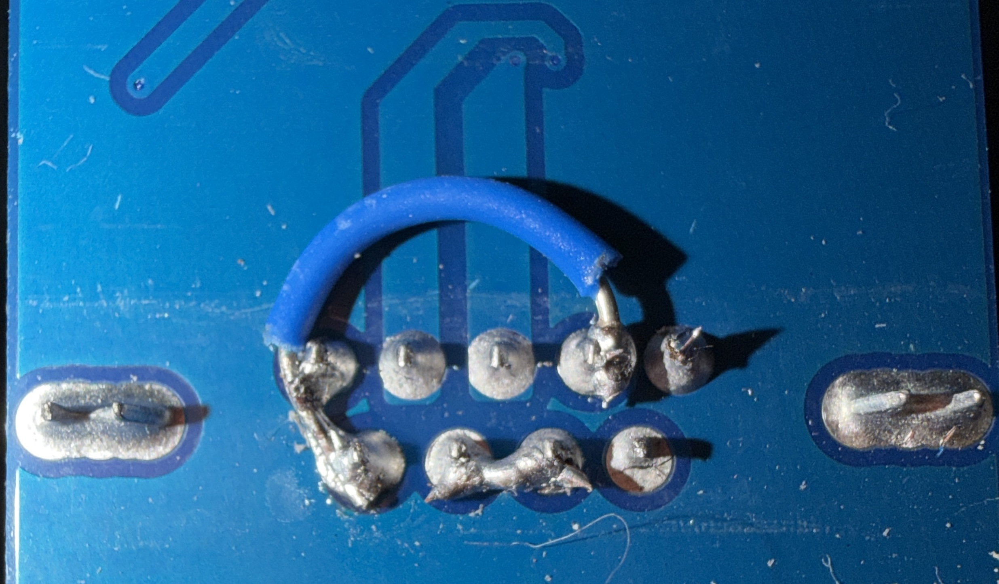
